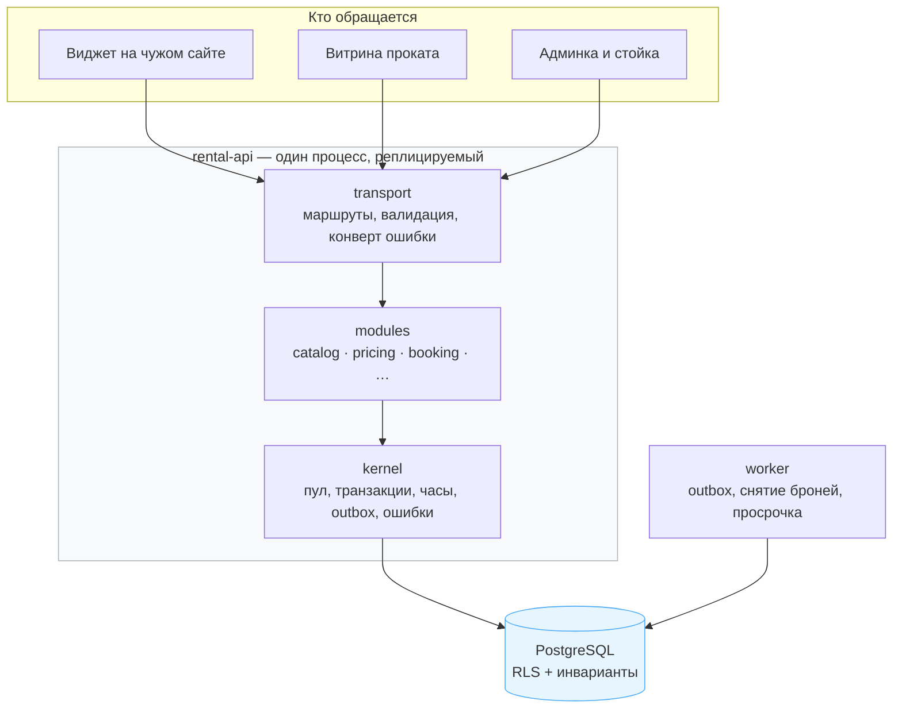
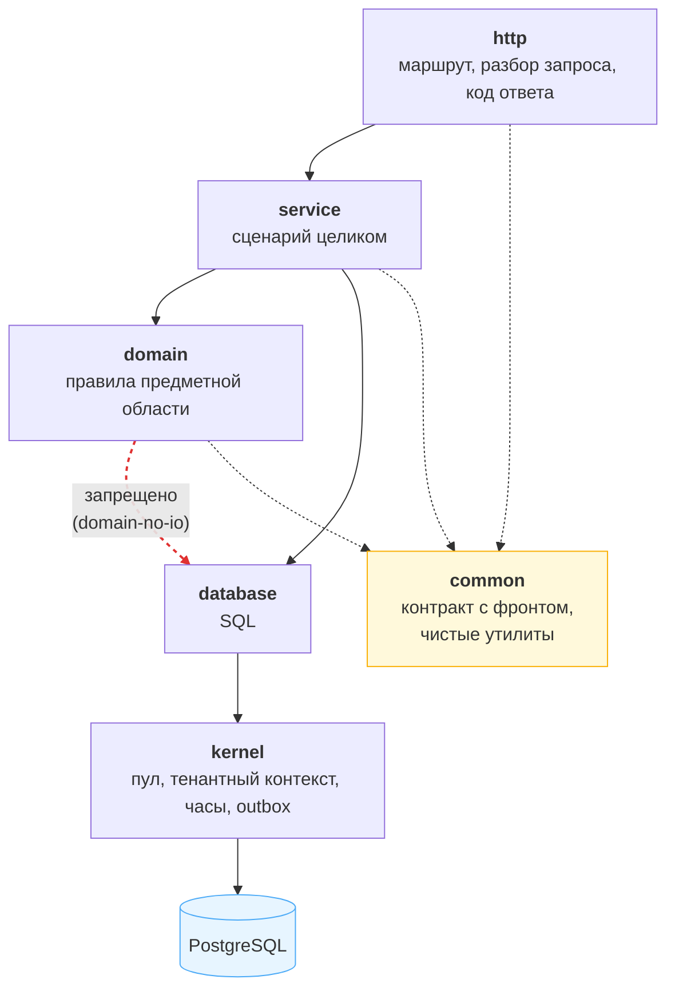
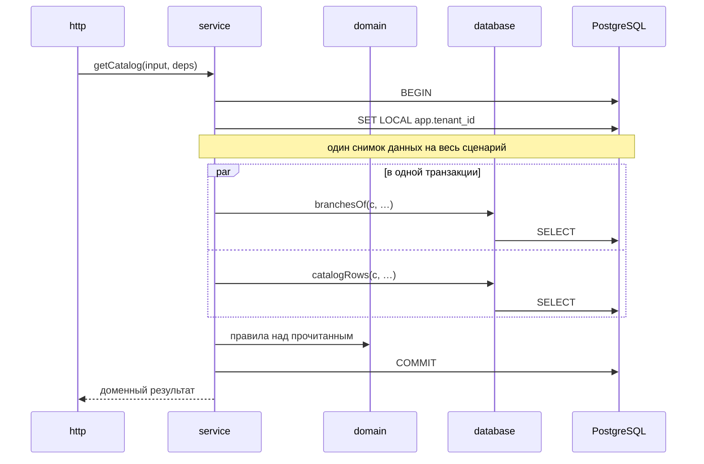
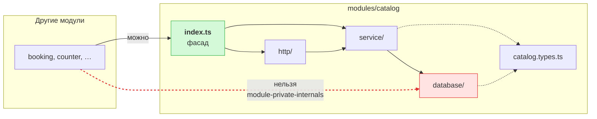
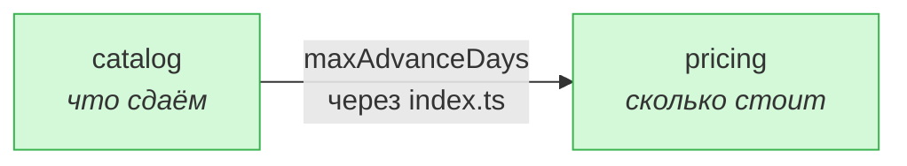
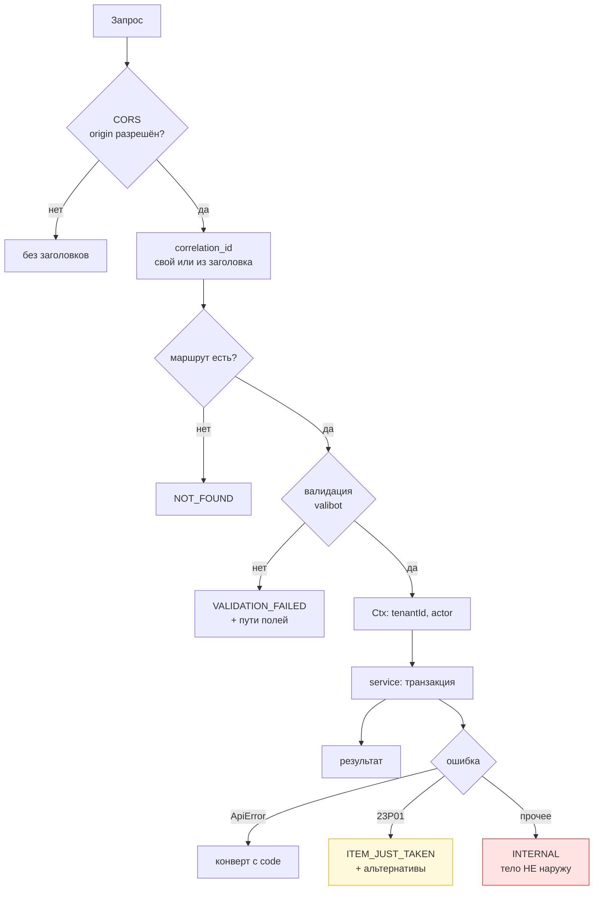
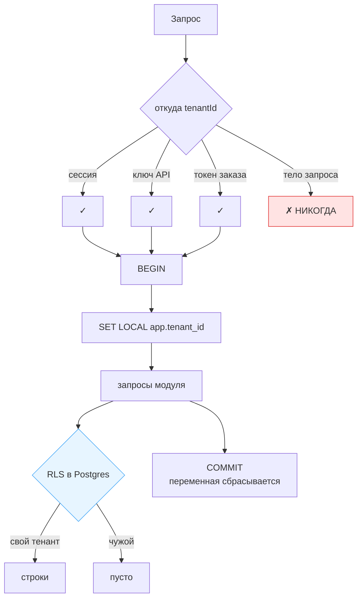
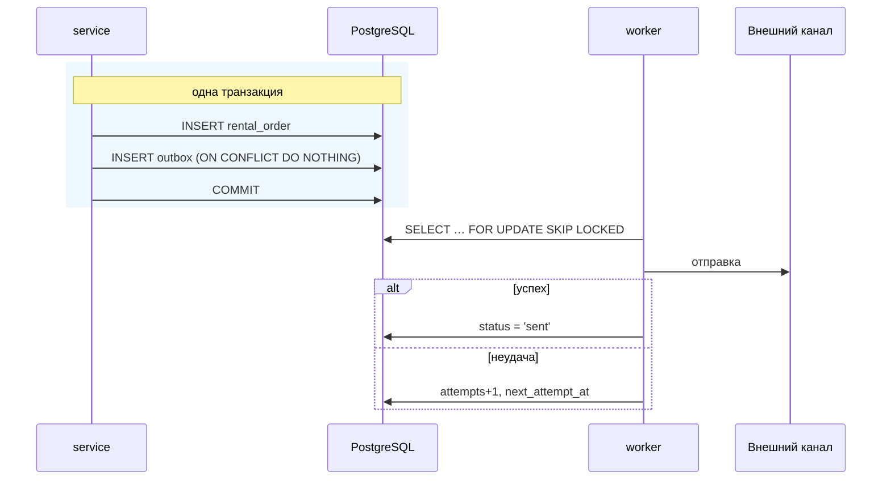

# Архитектура бэкенда

Как устроен сервис, почему именно так и что нельзя нарушать. Открывается **до** написания
кода; при правке конкретного модуля — `src/modules/<модуль>/CLAUDE.md`.

---

## Одним взглядом



⚠️ **Веб-процесс и воркер — разные процессы, и это принципиально.** Фоновый таймер внутри
веб-приложения при трёх репликах сработал бы трижды, и одна бронь снималась бы три раза.

⚠️ **Инварианты живут в БД, а не в коде.** Двойное бронирование, переполнение пула,
пересечение ценовых правил, изоляция тенантов — всё это ограничения Postgres. Проверка на
уровне приложения **не закрывает гонку**: между `SELECT` и `INSERT` успевает вклиниться
второй запрос.

---

## Слои

Зависимости идут **вниз и только вниз**. Проверяет `npm run arch`; нарушение роняет сборку.



| Слой | Знает про | Не знает про |
|---|---|---|
| `http` | HTTP, схемы валидации, коды ошибок | бизнес-правила, SQL |
| `service` | последовательность шагов, транзакцию | HTTP, конкретный SQL |
| `domain` | правила предметной области | HTTP, откуда пришли данные |
| `database` | SQL и схему таблиц | HTTP, зачем спросили |
| `kernel` | соединения, часы, журнал | предметную область |

### Почему транзакцию открывает `service`



⚠️ **Правило родилось из дефекта.** Каталог читал шестью отдельными транзакциями — шесть
независимых снимков, между которыми склад мог измениться: витрина показывала вариант,
которого в списке сезонов уже не было.

⚠️ **`domain` и `database` получают готовый `PoolClient`** и не знают, кто его открыл.
Иначе сценарий нельзя собрать из нескольких шагов в одной транзакции.

### Почему в сигнатуре `service` нет объекта запроса

```ts
export async function getCatalog(input: GetCatalogInput, deps: Deps) { … }
//                               ↑ уже провалидировано   ↑ БД, часы, очередь, журнал
```

Как только сюда попадает `FastifyRequest`, сценарий нельзя вызвать из воркера, из теста и
из будущего мобильного приложения стойки — слой перестаёт быть переносимым. Это первое,
что ломается на практике.

---

## Модули

Вертикальный срез: внутри модуля свои слои, наружу — один файл.



⚠️ **Проверка обязательна, договорённости недостаточно.** Сейчас связность низкая, и
держится она на вкусе разработчика. Достаточно одного «мне нужно только одно поле из их
таблицы» — и через год вернуться назад невозможно.

⚠️ **Наружу уходят доменные типы, а не строки таблиц.** Если сосед привяжется к
`{ tenant_id, branch_pickup_id, … }`, переименование колонки сломает чужой модуль.

### Кто с кем связан сейчас



Одна связь, один факт — горизонт бронирования. Копия горизонта в каталоге завела бы второе
место, где живёт то же правило.

### Владение данными

```
ПИСАТЬ в таблицу может только модуль-владелец.
ЧИТАТЬ может любой модуль — обычным JOIN.
```

⚠️ Учебное «каждый модуль владеет своими таблицами» проверено на этой схеме и в чистом
виде **неприменимо**: `category` читают 9 областей, `inventory_variant` — 8. Запретить
чтение значит превратить расчёт цены в цепочку вызовов через фасад **внутри одной
транзакции** — медленный способ сделать `JOIN`.

⚠️ Запрет именно на **запись**: чтение в худшем случае даёт устаревшую картину, а запись
из двух мест означает два места, где живёт правило. `capacity` в `pool_day` правили шесть
мест — и разошлись: 11 вещей физически, 6 в счётчике, витрина не продавала половину парка
и молчала об этом.

---

## Путь запроса целиком



⚠️ **`tenantId` берётся ТОЛЬКО из сессии, ключа API или токена заказа — никогда из тела
запроса.** RLS доверяет `app.tenant_id`, который выставляет приложение; подмена одного
поля дала бы доступ к чужим данным.

⚠️ **Нарушения инвариантов БД — бизнес-ответы, а не 500.** `23P01` (exclusion) — самая
частая ошибка в воронке бронирования, и она обязана приходить **с альтернативами**, иначе
клиент уходит.

⚠️ **Тело непредвиденной ошибки наружу не уходит:** текст исключения способен содержать
фрагмент SQL и имена колонок. Клиенту — код и `correlationId`.

---

## Изоляция тенантов



⚠️ **`SET LOCAL`, а не `SET`** — сбрасывается по завершении транзакции и не протекает
между запросами в пуле.

⚠️ **Роль приложения — без `BYPASSRLS`.** Воркер ходит под отдельной ролью с `BYPASSRLS`,
потому что работает поперёк тенантов по определению: очередь одна на всех.

⚠️ **Это уже стоило неработающей витрины.** На машине разработчика приложение ходило под
владельцем БД, для которого RLS не применяется, и всё работало. В проде роль другая, и те
же запросы возвращали ноль строк — «Прокат не найден» при полной базе. **Разница между dev
и прод была не в коде, а в РОЛИ.**

---

## Эффекты: outbox



⚠️ **Таблица в Postgres, а не Redis.** Redis не участвует в транзакции Postgres: при
падении между `COMMIT` и записью в очередь заказ был бы создан, а уведомление потеряно.

⚠️ **Гарантия «хотя бы один раз»** — обработчики обязаны быть идемпотентны: одно событие
может прийти дважды.

⚠️ **Не заменять событиями то, что должно быть синхронным.** Цена и наличие считаются в
той же транзакции, что и создание заказа: асинхронность здесь означает заказ по цене,
которой уже нет.

---

## Что проверяет CI

Девять правил в `.dependency-cruiser.cjs`, каждое проверено **нарушением**, а не на веру.

```
transport-is-top           общий HTTP-набор доступен только слою http модулей
service-no-http            service не знает Request/Response
domain-no-io               domain не импортирует database, integrations, pg
database-no-http           слой БД не знает про HTTP
module-private-internals   снаружи модуль виден только через свой index.ts
no-module-cycles           цикл между модулями = один модуль в двух каталогах
common-is-leaf             common ни от чего не зависит
kernel-knows-no-domain     kernel не знает предметную область
no-orphans          (warn) файл, который никто не импортирует
```

Плюс два теста, которые графом импортов не выразить:

- **дрейф схемы** — `pg_constraint` против ожидаемого списка;
- **порядок блокировок** — `pool_day` → `branch_capacity` → exclusion. Любой другой
  порядок даёт взаимную блокировку на многодневных бронях.

---

## Связанные документы

| Документ | О чём |
|---|---|
| [`железные-правила.md`](железные-правила.md) | что нельзя нарушать без обсуждения |
| [`бд-и-инварианты.md`](бд-и-инварианты.md) | схема, ограничения, RLS |
| [`алгоритмы.md`](алгоритмы.md) | наличие, цены, подбор |
| [`api.md`](api.md) | контракт, версионирование, ошибки |
| [`адаптеры.md`](адаптеры.md) | границы внешних систем |
| [`СОСТОЯНИЕ.md`](СОСТОЯНИЕ.md) | что переехало из Nuxt, что нет |
| [`../plans/`](../plans/) | что ещё не реализовано: модули, данные, нагрузка, этапы |
